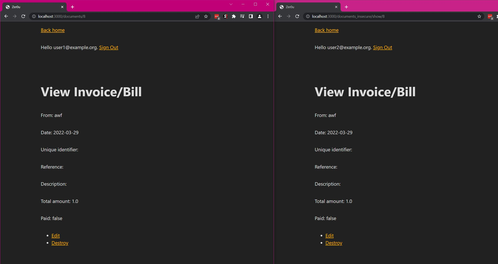
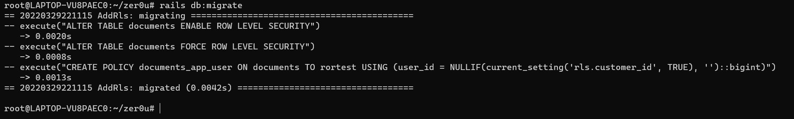
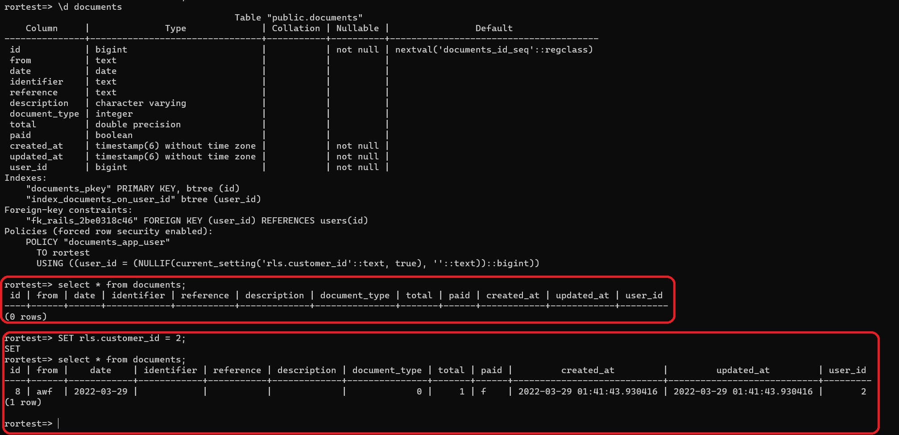
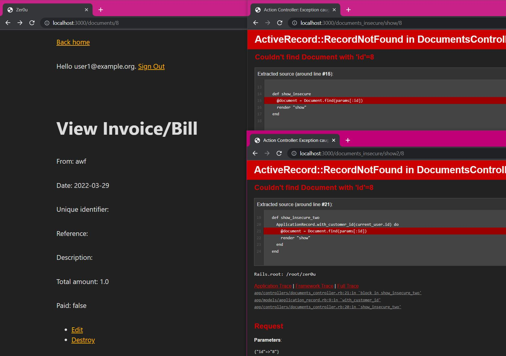
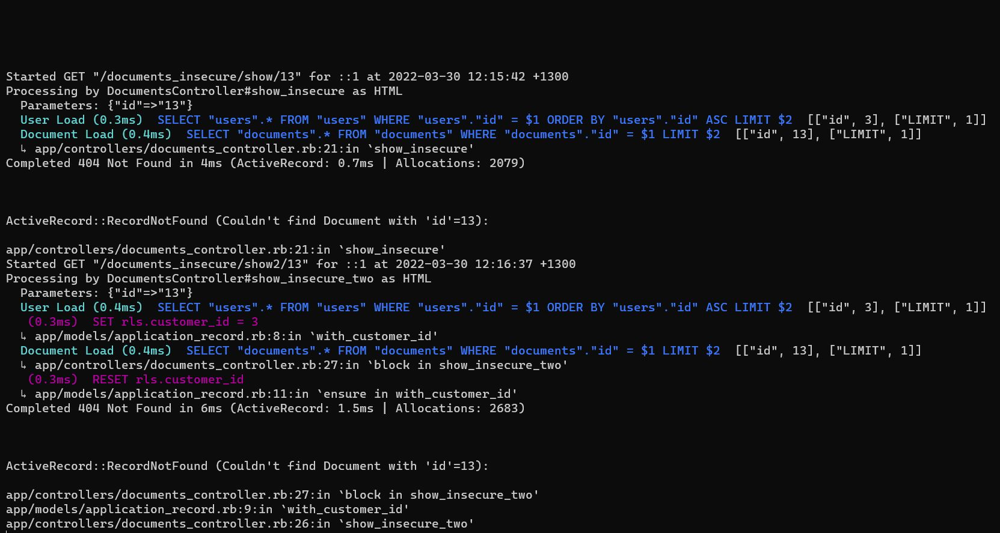
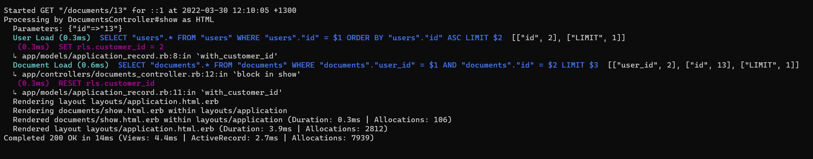

# zer0u

A proof of concept ruby on rails multi-user bookkeeping system using
PostgreSQL's row-level security for authorisation.

The main purpose of the repository is to explore the potential for integrating
PostgreSQL's [Row Level Security
(RLS)](https://www.postgresql.org/docs/9.5/ddl-rowsecurity.html) into a Ruby on
Rails application. I think that certain types of Rails applications, such as
multi-user applications, have the potential to benefit greatly from this from a
security perspective.

My main goal when exploring this is to prevent Insecure Direct Object Reference
(IDOR) vulnerabilities. This vulnerability type is very common and RLS has the
potential to introduce an additional layer of defense in depth that can prevent
exploitation if security measures on the applicaiton level fail. 

# Overview

The application has a [Document](app/models/document.rb) model, which stores
information in the database about invoices and bills. This is related to a
[User](app/models/user.rb), which owns an arbitrary number of documents. User
authentication is implemented using devise.

Rersourceful routes are configured and the associated controller is present in
the [document_controller.rb](app/controllers/documents_controller.rb) file. I
created another routefor `document_insecure/show/:id`, which shows an insecure
coding pattern which leads to IDOR:

```
  def show_insecure
    @document = Document.find(params[:id])
    render "show"
  end
```

The code above is insecure because it fails to verify that the retrieved
document belongs to the currently logged in user. The image below shows two
browsers, each with a different session belonging to different users accessing
the same document.



# Enter Row Level Security

The idea is to create a new default where if any of the developers of our
organisation make a mistake similar to the one above this doesn't result in the
exfiltration of data from our DB. Here are some resources I used in order to
learn about this:

* [Using Postgres Row-Level Security in Ruby on Rails by PGAnalyze](https://pganalyze.com/blog/postgres-row-level-security-ruby-rails)
* [Designing the most performant Row Level Security schema in Postgres](https://cazzer.medium.com/designing-the-most-performant-row-level-security-strategy-in-postgres-a06084f31945)

Caveat: RLS does not prevent, nor necessarily reduce the impact of SQL
injection vulnerabilities. For more information regarding SQL injection
vulnerabilities in Rails see [here](https://rails-sqli.org/)

If you read through the resources above it is easy to see that RLS is not a
first-class citizen of Rails. Additionally, because RLS is highly specific to
your application you will need to implement specific policies.

In my case, I opted to create a migration that would enable a specific policy
for my documents.

```
class AddRls < ActiveRecord::Migration[7.0]
  def change
    # Define RLS policy
    reversible do |dir|
      dir.up do
        # Use FORCE to ensure the restrictions apply to the table owner as well.	
        # Per docs: Superusers and roles with the BYPASSRLS attribute always bypass the row security system when accessing a table. 
        # Table owners normally bypass row security as well, though a table owner can choose to be subject to row security with ALTER TABLE ... FORCE ROW LEVEL SECURITY.
        # https://www.postgresql.org/docs/current/ddl-rowsecurity.html
        execute 'ALTER TABLE documents ENABLE ROW LEVEL SECURITY'
        execute 'ALTER TABLE documents FORCE ROW LEVEL SECURITY'
        execute "CREATE POLICY documents_app_user ON documents TO rortest USING (user_id = NULLIF(current_setting('rls.customer_id', TRUE), '')::bigint)"
      end
      dir.down do
        execute 'DROP POLICY documents_app_user ON documents'
        execute 'ALTER TABLE documents DISABLE ROW LEVEL SECURITY'
      end
    end
  end
end
```

This creates a policy that allows access to documents only if the row's
user\_id value is equal to a rls.customer\_id setting value. We will be setting
that value to the currently logged-in user's ID at the time we make the query.

We apply the migration:



After the migration we can ensure this works at the SQL level by running the
query both without and with the `rls.customer_id` runtime parameter. 



In the image above we can observe that running the query with the variable
unset yields zero results, whereas it returns one result after the variable is
set.

We can now modify the controller code to set the variable when making the
query:

```
  def show
    ApplicationRecord.with_customer_id(current_user.id) do	
      @document = current_user.documents.find(params[:id])
    end
  end
```

The `ApplicationRecord.with_customer_id` method is defined [here](app/models/application_record.rb).

In the image below, we can see that the insecure method now fails to retrieve
sensitive information that doesn't belong to the user, despite the
implementation flaw:



Another pattern that seems initally insecure also fails to retrieve information
from the DB:

```
  def show_insecure_two
    ApplicationRecord.with_customer_id(current_user.id) do	
      @document = Document.find(params[:id])
      render "show"
    end
  end
```

Here we can see the puma logs, and how both endpoints fail:



For comparison, here is a successful retrieval by an authorised user:



# Closing thoughts.

I think RLS is pretty neat and as I mentioned above it can be a good extra
layer of security to give that extra certainty if your use case demands it.

In terms of the application changes required, they are relatively simple, as
they require only the setting of the PostgreSQL variable. This could
potentially be done automatically in a way that doesn't require the use of the
`with_customer_id` block.

Because the pattern fails closed, the risk of introducing new security risks
from implementing this pattern is low. The risk of introducing functional
regressions is very high however and implementing this in a production
environment would require end-to-end retesting of the whole system I think.

Even on my simple CRUD application, I found an edge-case that resulted in
broken functionality on the `index` method:

```
  def index
    ApplicationRecord.with_customer_id(current_user.id) do	
      # This fails because the query is executed outside of the block.
      # @documents = current_user.documents

      # Cause records to be loaded from the DB (See: https://apidock.com/rails/ActiveRecord/Relation/load)
      @documents = current_user.documents.load
    end
  end
```

Because `current_user.documents` was lazily loaded, it was loaded when the view
was being rendered and therefore outside of the `with_customer_id` block. We
need to explicitly force the load within the block for the variable to be set
when the query is executed.

Another thing to note is the following, from the article above:

```
It's important that your application keeps using the same Postgres connection
for its queries, as the one that we issued the SET command on. Rails currently
makes this quite straightforward, as the same connection will be used within a
single Rails web request. Connections are returned to the pool after a request
has finished (and we would have called RESET rls.customer_id).

If you have code that directly interacts with the Rails connection pool you
should review the Rails connection pool documentation or consider using a
transaction and SET LOCAL.

Any custom code that interacts with the Rails connection pool, or third-party
connection poolers, such as pgbouncer in transaction pooling mode, have a risk
that the security context gets mixed up, since a different connection could run
the queries than the one that used the SET command. In those cases using a
wrapping transaction together with SET LOCAL is the safest approach.
```

